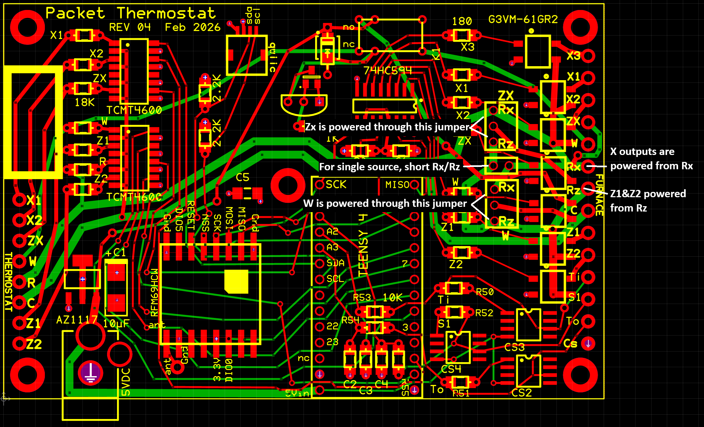
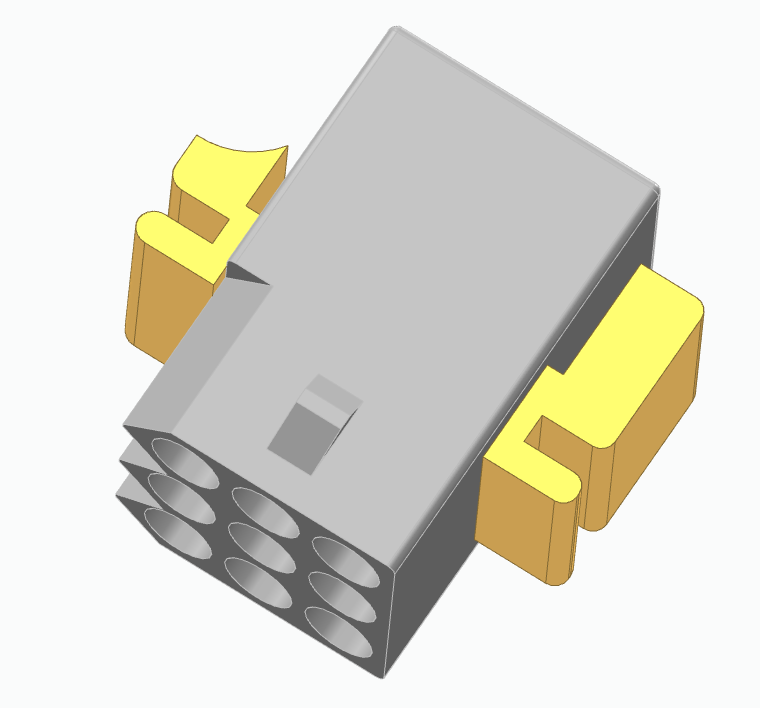
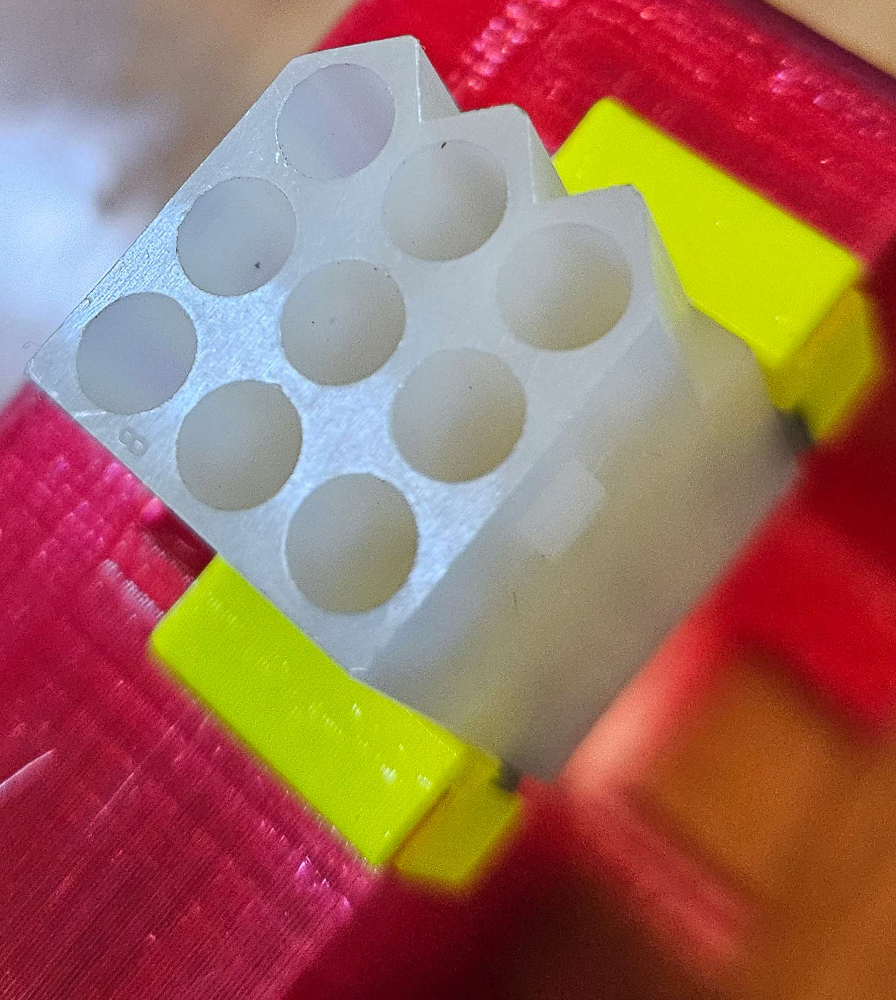
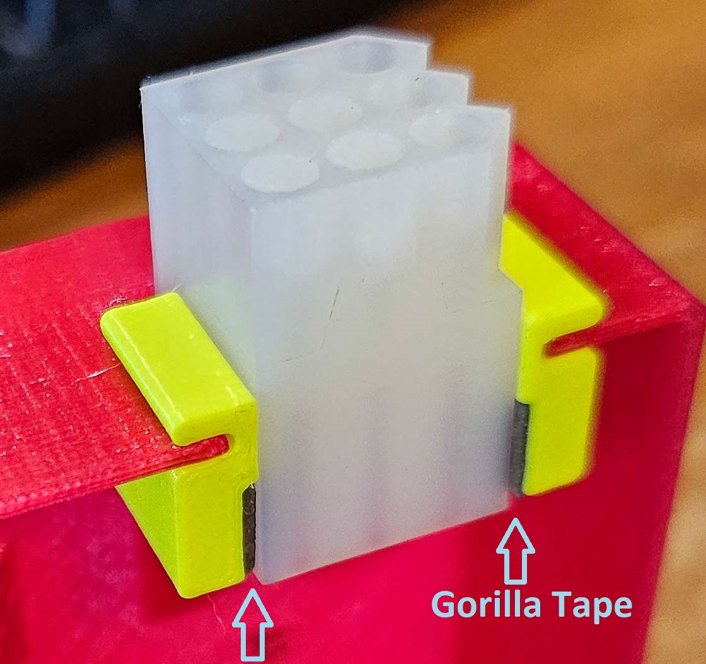

<h2>Printed Circuit Board</h2>
The gerber files for REV04 PCB fabrication are <a href='PCB/REV04-Gerbers.zip'>here</a>. 
While there are some through-hole patterns on the PCB,
many of the parts are available only SMD. A <a href='https://www.whizoo.com/controleo3'>Reflow Oven</a> makes PCB assembly
faster and easier.
Or if your hand is steady enough for 50 thou IC pin spacing, you can hand solder.

I had bad results reflow soldering with the RFM69 in place. Solder paste spreads under the 
module and shorts its vias. Its easier to hand solder it.

All parts mount on the PCB top.

The enclosure is 3D printable on common 3D printers. The printable STL files 
are <a href="STL">here</a>. If instead you want to design a different enclosure, then you are welcome to start with the
CAD models <a href="CAD">here</a>.

I used PETG filament. It prints in three parts: the top, the bottom and a 1/4" diameter bracing cylinder.
Where does that little cylinder go? Use a #4 machine screw x 1/8" inserted 
through the bottom of the PCB in the hole in the middle of the board. The cylinder 
is permanently left in place (only <i>after</i> you have reflow soldered, of course.)
Orient it so its rounded edge faces the PCB board edge in the direction of the qwiic connector. Its purpose is 
to keep both the LCD and the PCB from
falling into the center of the enclosure by pressing them against the top and bottom, respectively.

The enclosure <b>top</b> has nut slots for 4 nuts, one each on the sides of the legs. Four #4 machine screws, 5/8" long, 
enter through the enclosure bottom and hold the entire assembly together.
(On the enclosure <b>bottom</b> 
there are two more slots if you happen to find them, but you may safely ignore 
these nut slots on the enclosure bottom. Those 4 screws through the entire assembly hold the PCB securely in place.)

<a href='https://www.mouser.com/Tools/Project/Share?AccessID=1a8a35c924'>Here</a> is a Mouser shared project with all the parts except the PCB, enclosure, and hookup wire.

<ol>
<li> <a href='https://www.sparkfun.com/teensy-4-0.html'>Teensy 4.0</a>. All power is solely from the 5V 
power jack, which requires: <i><b>before installing</b></i>, cut the Teensy's back side VIN/VUSB jumper.
</li>
<li> <a href='https://www.sparkfun.com/products/16281'>SparkFun Real Time clock module, RV-8803</a> </li>
<li> <a href='https://www.sparkfun.com/products/13909'>Sparkfun RFM69HCW packet radio module.</a></li>
<li> <a href='https://www.sparkfun.com/products/14417'>Sparkfun Qwiic SMD connector</a></li>
<li> <a href='https://www.sparkfun.com/products/16396'>Sparkfun 16x2 SerLCD -RGB - Qwiic</a></li>
<li> <a href='https://www.mouser.com/new/omron-electronics/g3vm-vr-mosfet-relays/'>G3VM-61GR2 Omron
Solid State Relay<a>. (Quantity: 7)</li>
<li> <a href='https://www.mouser.com/datasheet/3/190/1/sy.pdf'>SPDT relay</a></li>
<li> <a href='https://www.vishay.com/docs/83512/tcmt1600.pdf'>Quad 
Optoisolator AC input, 4mm 16-SOP</a>. (Quantity: 2)</li>
<li> <a href='https://www.st.com/resource/en/datasheet/lm234.pdf'>LM334 Current Source, 8-SOIC</a>, 4mm width. (Quantity: 3)
 Pin 1 is on the beveled side of the LM334</li>
<li> <a href='https://www.mouser.com/datasheet/3/175/1/AZ1117I.pdf'>3.3V regulator, SOT223</a></li>
<li> <a href='https://www.mouser.com/datasheet/3/101/1/MMBT100-D.PDF'>2n3904 (or equivalent) in SOT-23</a></li>
<li> <a href='https://www.ti.com/lit/ds/symlink/sn74hc594.pdf'>74hc594 shift register in 4mm width 16-SOIC </a></li>
<li> All resistors and capacitors on the PCB have dual SMD pads size 1206. Except the SMD for the 10uF polarized is 2312</li>
<li> Use a 5VDC wall wart. Do not use anything higher than 6V!
</ol>
All of the Sparkfun products listed above are also in Mouser's catalog. 

|Quan|Item|Value|Form|
|:-|:-|:-|:-|
|1|C1|10µF|EIA 2312|
|3|C2, C3, C4|.022µF|Chip EIA 1206 |
|2|C5, C6|.01µF|Chip EIA 1206 |
|3|CS2, CS3, CS4|LM334|SO8 208 mil 8S2|
|1|D1|1N4148|EIA 1206 or  DO-35 (0.3 in hole spacing)|
|1|J15|2.1 mm barrel jack PJ-202A|for power plug|
|1|Q13|2N3904 or similar|SOT-23 or TO-92|
|2|R1, R2|1K|EIA 1206|
|3|R5, R6, R52|2.2K|EIA 1206|
|7|R31, R32, R33, R34, R35, R36, R37|18K|EIA 1206|
|7|R41, R42, R43, R44, R45, R46, R47|180|EIA 1206|
|2|R50, R51|68|EIA 1206|
|3|R53, R54, R55|10K|EIA 1206|
|1|U2|74HC594|SOIC 16|
|2|U3, U4|TCMT4600|SOP-16|
|1|U5|AZ1117|SOT-223|
|7|U11, U12, U13, U14, U15, U16, U17|G3VM-61GR2|SOP-4|

Mechanical parts:
<ol>
<li> <a href='https://www.digikey.com/en/products/detail/molex/0003091091/26302'>OBSOLETE. 9 pin Molex RECPT panel mount</a>. 
Modify the free hanging 9 pin RECPT: 3D print the Molex9Insert, and use Gorilla glue double-sided tape.</li>
<li> <a href='https://www.molex.com/en-us/products/part-detail-pdf/03091094?display=pdf'>9 pin Molex 03091094 RECPT free hanging</a>. (Quantity: 2)</li>
<li> <a href='https://www.molex.com/en-us/products/part-detail-pdf/03092092?display=pdf'>9 pin Molex 03092092 PLUG free hanging</a>. (Quantity: 2)</li>
<li> <a href='https://www.molex.com/en-us/products/part-detail-pdf/469990653?display=pdf'>4 pin Molex 469990653 RECPT panel mount</a></li>
<li> <a href='https://www.molex.com/en-us/products/part-detail-pdf/03092049?display=pdf'>4 pin Molex 03092049 PLUG</a></li>
<li> <a href='https://www.molex.com/en-us/products/part-detail-pdf/02092118?display=pdf'>Molex 02-09-2118 PIN</a>. (Quantity: 22)</li>
<li> <a href='https://www.molex.com/en-us/products/part-detail-pdf/02091119?display=pdf'>Molex 02-09-1119 SOCKET</a>. (Quantity: 22)</li>
<li> <a href='https://www.mouser.com/datasheet/3/6118/1/pj_202a.pdf'> PJ-202A 2MMx5.5MM kinked pin power jack</a></li>
<li> <a href='https://www.mouser.com/datasheet/3/85/1/htsw_th.pdf'>Samtec TSW-150-07-T-S 0.100 inch Connection headers</a>. (Quantity: 3) 
Use this specified header soldered both sides and without a socket to be sure the micro USB on the CPU lines up with its hole in the enclosure</li>
<li> <a href='https://www.sparkfun.com/products/17260'>50mm Qwiic cable</a>. (Quantity: 2)</li>
</ol>
The Molex quantities listed include (exactly enough) parts to populate the enclosure <i>and</i> one free hanging mating connector.

You have to decide at assembly time which PCB otuput/input should be wired to which 
Molex pin number. Here are some recommendations:

<ul>
<li> Use the same pinout on the two 9 pin molex housings, and put pins in one and sockets in the other. The result is that 
you can
unplug the packet thermostat and plug the two hanging connectors to each other and the furnace will operate without it.
Maybe your HVAC service person would be more comfortable working on a unit without a mysterious box on its 
control cable?</li>
<li>AWG 18 wire is recommended for the furnace-facing 9 pin molex. </li>
<li>AWG 18 wire is also recommended for the thermostat side for the W, R and C wires because they carry the
full current demand of the furnace/wall-thermostat connection.</li>
<li>A smaller gauge, e.g. AWG 24, is fine for the remainder of the thermostat-facing molex, and for the wires to the thermometers as all of these carry much smaller current.</li>
<li>Along the furnace facing side of the board, the number of holes in the PCB (14) is one more than the 
number of pins in the specified
Molex connectors (13). If you're still looking for another wire into the enclosure, a last resort might be the
opposite side of the PCB. It has the reverse
situation: one more molex pin (9) than holes in the PCB (8).
</ul>
Part orientations
<ul>
<li>Only one orientation of the RTC module fits the enclosure:
<ul>
<li>Its qwiic connectors face away from the enclosure top
<li>The lithium cell faces toward the enclosure top, and is towards the LCD display.
</ul></li>
<li> The RTC module has two qwiic connectors. Electrically, it does not matter which goes to the 
LCD and PCB, but you'll discover the 50mm length cables only fit one way.
<li>The LCD display recommended orientation is that its lettering is upright when 
the LCD window in the enclosure is LOWER. It can be oriented the other way,
but there are two disadvantages to the other orientation.
<ul>
<li>The specified 50mm qwiic cable is too short
<li> The micro-USB and 5VD power holes are on the box top where gravity pulls dust into the box.
</ul></li>
</ul>

There are 3 jumper positions. Two of them <b>require</b> you install a jumper: the outputs ZX and W
each may be powered from either Rx or Rz, but no jumper means no power. To know which
R in the thermostat to connect to which R in the furnace, you need to 
<a href='https://www.epatest.com/store/resources/images/misc/how-a-thermostat-operates.pdf'>know a little about how your 
furnace is wired</a>. Its easy if your furnace has only a single power wire ("single transformer" in the
link above), usually called R, in which
case jumper the PCB position for single source Rx and Rz (the jumper position on the PCB between the 
boxes for ZX and W) and also install a jumper in the ZX and W boxes, and, for a single source,
it makes no difference which jumper position you choose.

In both the ZX and W boxes, a jumper must be placed from the center hole to either the one above (Rx)
or the one below (Rz).

If your furnace has split power, then you have to know which thermostat wires need to be powered
from which R wire (Rx or Rz) and you have to choose the PacketThermostatSettings to match,
and you need to take care in which position you jumper the ZX and the W box, and you must <b>not</b> install the Rx/Rz jumper.

Firmware and initial test
<ol>
<li>Load the sketch on the Arduino using the Arduino IDE (or the software tool of your choice).
<li>The packet radio won't function until you program its Network ID, Node ID, and Frequency Band into its 
EEPROM. And if you're running your gateway
encrypted, you have to specify the key. (By the way, the symptom if the encryption keys on this thermostat and
the gateway do not match, is the packets are delivered anyway, but they are gibberish.)
<li>On an out-of-the-box Arduino, the EEPROM comes will all bits set, which corresponds to no types 
nor modes other than 
Pass through per the below instructions. The commands here initialize the thermostat
to pass-through mode. Use the Arduion IDE "Serial Monitor" function with 9600 baud set. The 
Arduino sketch, if properly installed, will response "ready>" after each command. If not...check the hardware 
and/or upload the sketch again.
<ul>
<li> HV R d G W Y2 Y O
<li> HVAC TYPE=1 COUNT=0
<li> HVAC TYPE=2 COUNT=0
<li> HVAC TYPE=3 COUNT=0
<li> HVAC TYPE=4 COUNT=0
<li> HVAC TYPE=0 MODE=0
<li> HVAC NAME=PasT
<li> HVAC COMMIT
</ul> On the penultimate command, the LCD should display the name <code>PasT</code></li>
<li> I strongly recommend you first test <i>only</i> the fan function (Green control wire). Most thermostats have 
a Fan On button. Try it. If anything is wrong, you have only one 
signal to debug. Its up to you to get the wire assignments right. Get them wrong on the furnace side of this
device and the device LCD displays one thing, but the furnace gets something else. 
<li> Test with the device wired between the conventional thermostat and the furnace. If the packet radio EEPROM setup is done,
you'll get messages at your gateway when the control wires change, but regardless of the radio, the thermostat should
pass through all incoming 24VAC signals from the thermostat to the furnace while displaying its output wire 
states on its LCD.
</ol>

The 3D printed adapters that make the 9 pin "free hanging" into a no-longer-manufactured "panel mount" are fastened to the free hanging molex receptacle using cut-to-fit squares of Gorilla tape like in the photos below. Cut the tape oversize, stick it to the 
insert, then use a sharp blade to trim the tape to the size of the insert. Mind the orientation. The free hanging Molex is flat
on all four sides, but there is only one orientation that matches what is installed on the furnace side.

  

The adapters should be flush with the pin 3/9 edge of the molex, not the pin 1 edge, in order to clear the wires coming off the PCB (not pictured.)

