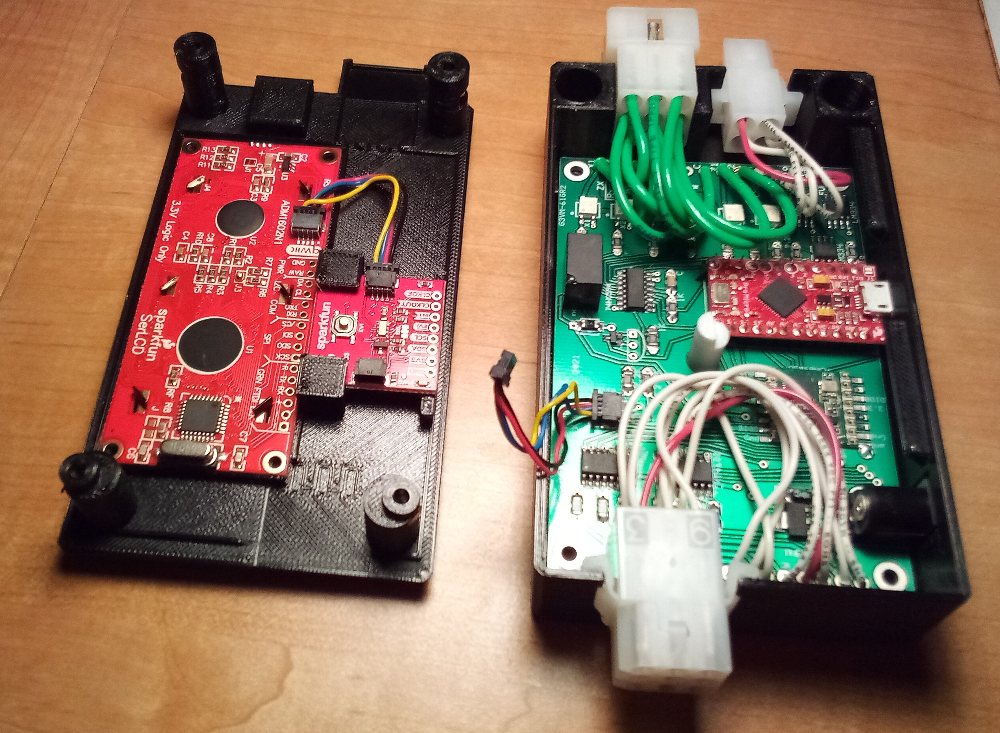

<h2>Packet Thermostat Project</h2>

Do you want to access your HVAC over the internet, but not want to open up your home network
some manufacturer's offshore web portal?
Here is an add-on that works on most HVAC systems (<i>i.e.</i> those with 24VAC control 
signals.) You keep
your existing thermostat whether or not it has wifi capability. This packet thermostat exchanges 
radio packets with a gateway to
your Windows or Linux PC. The PC can, in the simplest mode, just monitor the wired
thermostat and report its commands. Or it can modify the commands to, for example, convert a call for
heat pump to a call for the furnace, or it can ignore the wired thermostat and take over 
full control. 

It has no hardware buttons. Adjust your conventional thermostat for your comfort when you 
are at home, while instructing this thermostat to its pass-through mode.

The Packet Thermostat must be installed along the wires
between the HVAC and the conventional thermostat. It doesn't matter where as long as there is a way to provide 5VDC to it. 
The packet radio has a range of roughly 500m from the Packet Gateway on a PC.

When you are not at home and need your HVAC settings to change, send a radio packet from the gateway to set this Packet 
Thermostat to one of its controlling modes. 
If your system has one of the simpler one stage or two stage conventional thermostats, the sketch and application
 presented here likely duplicate
its functionality without customization. 

If your HVAC instead has control requirements beyond that implemented here, this project is open source and
free for you to modify. Any HVAC system
with 24V AC control signals and with up to six controls from the thermostat and up to seven 
signals at the furnace can be implemented. (Of what use is that seventh output beyond the six inputs? Maybe 
your HVAC system
has an auxilliary duct booster fan that needs to be activated, say, whenever any of the other six is on.)

This design facilitates integrating the application into a web based home automation system.

There is no GUI for this thermostat in this repository. The repository at 
<a href='http://github.com/w5xd/diysha'>http://github.com/w5xd/diysha</a>
implements a web server that can be used to remotely control this device over the internet.

The device design consists of:
<ul>
<li>A printed circuit board (PCB) which hosts an Arduino, an RFM69 packet radio, 8 total wires (which must include
a power and a common) toward 
the standard wired thermostat, and 14 wires
toward the HVAC. The surplus of wires toward the HVAC unit are to support wired thermometers so this unit
can monitor what is happening right at the furnace. All the parts on the PCB are available at this writing as documented
by this
<a href='https://www.digikey.com/short/n2hpzb1w'>digikey saved cart</a>.
<li>An enclosure of 3D printable parts that mounts the PCB along with 3 molex connectors. 
This repository has the printable STL files, and also the Solidworks model used to
generate them.
<li>An Arduino sketch.
<li>A command line application  that runs on either Linux or Windows for the purpose of setting
the detailed configuration of the thermostat EEPROM customized to the actual wiring in your HVAC system.
</ul>

The PCB qwiic connector in the photo is an earlier
PCB rev with opposite orienation of later revisions

A good summary of the standard
names, colors, and functions of thermostat control wires can be found
<a href='https://www.epatest.com/store/resources/images/misc/how-a-thermostat-operates.pdf'>here</a>.
In terms of that traditional thermostat wiring nomenclature, this PCB supports any installation using 
up to two 24VAC power sources:
<ul>
<li> C (24VAC common)
<li> Either a single R wire, or separate R heat from R cool. (24VAC source or sources traditionally called Rc and Rh.)
</ul>
Signal wires:
<ul>
<li> W, W1 and/or W2 (3 stages of heat)
<li> Y, Y1 and/or Y2 (3 stages of cooling)
<li> O or B (heat pump reversing valve control)
<li> Dehum (dehumidify)
<li> ...any other 24VAC signal that your installation might need up to a total of 6 inputs from the thermostat, and 7 outputs to the HVAC.
</ul>

Of the standard wire names only C, R and W appear on the PCB silkscreen and in the sketch.
For the remaining signals, the convention
in this design is to use the letters X and Z to name them. It is up to the PacketThermostatSettings application to
assign the standard names that appear in your particular HVAC installation to the generic names on this 
thermostat's PCB and sketch.

The block diagram above shows that the W wire is treated uniquely. It is routed through a hardware relay
that passes the heat signal (W) through when the PCB is powered down. This allows a fail-safe operation so the 
heating function still works
if the Packet Thermostat is not powered, and is why the W wire keeps its standard name. However, 
the PacketThermostatSettings 
application could be modified to reassign even the W wire if your application requires some signal other than W
to be passed through while the 5VDC power is unavailable.

The standard name is also used for the 24VAC supply, R. Like the standard in conventional thermostats,
as many as two are supported by the PCB. But it doesn't use the standard names Rc and Rh. Their names in this 
design are Rx and Rz in order to indicate that the PCB's output signals named
X1 through X3 are powered by Rx, while Z1 and Z2 are powered by Rz. The remaining two outputs, W and ZX are wired
to PCB jumpers to enable installation-specific 24V power from either Rx or Rz on those signals.
If your furnace has only one R wire, the PCD provides a position to jumper the Rx and Rz terminals to each other.

The furnace-facing side of PCB has 4 terminals to support 3 wired thermometer inputs sharing a 
common ground. The sketch
includes the necessary programming to convert the Arduino ADC pin reading for either an 
LM235 solid state thermometer or 
a Honeywell C7089U thermistor.
The silk screen and sketch call out two LM235's and one thermistor, but the only difference 
between the two devices
is one resistor value along with the corresponding programming in the sketch. 
Any combination of those two sensor types totalling 3 can be supported by
substituting the appriorate resistor and modifying the sketch. 

In addition to sending and receiving packets with the Packet Gateway for status updates and changes, the sketch
puts its RFM69 in spy mode such that it receives any Packet Thermometer notifications on its same radio 
frequency and network ID.
Such a Packet Thermometer temperature update (along with its relative humdity update if it sports an HIH6130) are
available to the Packet Thermostat sketch.

The provided sketch software supports being set into any of the following operating types:
<ol>
<li> Pass through. In this type, it copies each of its 6 inputs to its corresponding output. W to W, X1 to X1, 
X2 to X2, ZX to ZX, Z1 to Z1, and Z2 to Z2. Because it has no corresponding input, X3 will never be asserted in Pass through mode.
<li> Map input to output.  In this mode, the thermostat takes its 6 inputs (which correspond to 2**6 = 64 combinations)
and updates its 7 outputs to the corresponding value in a 64 byte table. The table is configured by the PacketThermostatSettings
application and loaded into the Arduino EEPROM.
<li> Heat.  The thermostat ignores its thermostat inputs. It is instead driven by notifications from one or more 
Packet Thermometers.
This type has several radio-controled settings. One for its target temperature (the turn OFF setting), another for its active temperature (its turn ON setting)
along with the required output wire signals for Stage 1, Stage 2, and Stage 3 heating. This thermostat commands Stage 1
on first encountering the activate temperature, then moves to Stage 2 and Stage 3 if the continuous ON time exceeds
the corresponding settings. 
<li> Cool.  The behavior in this type takes the same settings as heat, but takes the opposite conditions on the received temperature.
It starts Stage 1 when a temperature
notification exceeds the activate setting, and stops when a notification is below the target. The Cool mode 
also adds a dehumidify setting and a dehumidify output mask. When the humidity is above the setting, the Cool
mode modifies its output.
<li> Auto. The auto type supports all the Cool type settings and adds a heat target temperature, 
a heat activate temperature, and Stage 1, 2 and 3 timings and output control wire settings.
</ol>

All the above settings are settable by radio packets or by a wired serial port, and all can be commanded to
be stored in the Arduino's EEPROM. The commands are documented in <a href='./Commands.md'>Commands.md</a>. Each type also has a five character name, which it will display on the LCD when
commanded into that mode.

The sketch supports a scheduling feature to adjust the Packet Thermostat's target temperature when its real time clock reaches a given
hour and minute and day-of-week. It supports a maximum of 16 time points, each with its own target temperature.

The sketch supports a safety shutdown feature that can be configured via its radio or serial port. It is independent of the mode settings listed above.
The feature has a command to set
a trigger temperature for the HVAC input temperature sensor. 
<i>When this trigger temperature is exceeded while the thermostat is in a heating mode, the furnace is shut down for a timed interval.</i>
The PacketThermostatSettings application is an easy way to set up
this feature. It sets the required parameters that configure this feature: the trigger temperature, the shutdown time,
the thermostat signal combinations that indicate a heat mode, and the thermostat signals to turn off to shut down the furnace.

Library versions that fit in program memory for this build:
Using library RFM69_LowPowerLab at version 1.5.1 
Using library SPI at version 1.0 
Using library Wire at version 1.0  
Using library EEPROM at version 2.0 
Using library SparkFun SerLCD Arduino Library at version 1.0.9  
Using library SparkFun Qwiic RTC RV8803 Arduino Library at version 1.2.2 
Using library SPIFlash_LowPowerLab at version 101.1.3 in folder: D:\Users\NonPr
